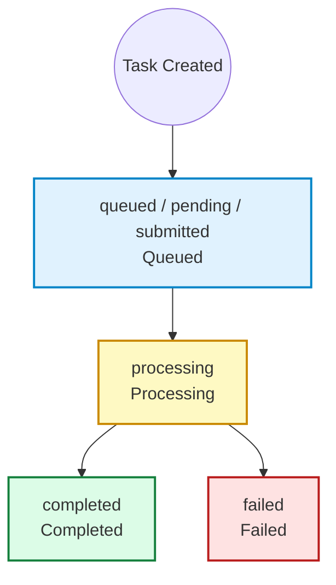

> [!IMPORTANT]
> The video download URL (`video_url`) is valid for **3 days**. Please download or transfer it in time.

The response field `data.cost` is the billed amount for this task (JimiCoin). It is returned on both create and query endpoints; per-user custom unit prices apply when configured in the console.

### Task Status Descriptions

| Status Value (status) | Description | Progress (progress) | Remarks |
| :--- | :--- | :--- | :--- |
| `queued` / `pending` / `submitted` | **Queued / Submitted**. The task has been successfully submitted and is waiting for scheduling. | `0` | Initial state. |
| `processing` | **Processing**. The task has started running on the model side. | `1 - 99` | Progress updates in real-time during generation. |
| `completed` | **Completed**. The video generation is complete. | `100` | The download link is available in the `result.video_url` field. |
| `failed` | **Failed**. The video generation task failed. | `0` | You can view the specific cause of failure in the `error_message` field. |

### State Machine Diagram

