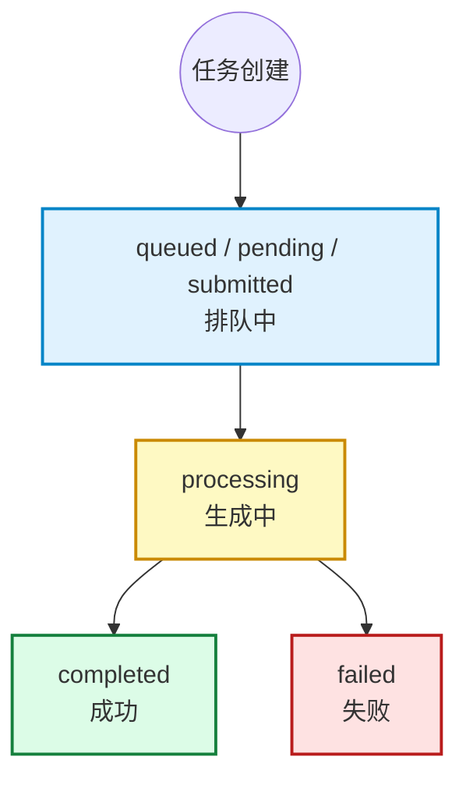

> [!IMPORTANT]
> 视频下载地址（`video_url`）的保存有效期为 **3天**，请及时转存。

响应 `data.cost` 为本次任务扣费金额（吉米币），创建与查询接口均返回；若配置了用户定制单价，则按定制价计费。

`seedance2.5-gz` 任务完成后，查询会返回 `data.usage`：

```json
{
  "usage": {
    "completion_tokens": 246840,
    "total_tokens": 246840
  }
}
```

未完成或无 token 数据时不返回 `usage`。

### 任务状态说明

| 状态值 (status) | 说明 | 对应进度 (progress) | 备注 |
| :--- | :--- | :--- | :--- |
| `queued` / `pending` / `submitted` | **排队中 / 已提交**。任务已成功提交，正在等待调度。 | `0` | 初始状态。 |
| `processing` | **生成中**。任务已开始在模型侧运行。 | `1 - 99` | 进度会随着生成过程实时更新。 |
| `completed` | **成功**。视频生成完成。 | `100` | 此时可在 `result.video_url` 获取生成的视频下载链接。视频翻译任务若开启字幕，另有 `result.caption_url`。 |
| `failed` | **失败**。视频生成任务运行出错。 | `0` | 可以在 `error_message` 字段中查看具体的失败原因。 |

### 状态机展示


