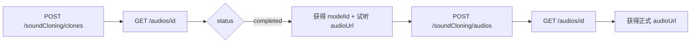

<Note>
声音克隆为**异步任务**。提交成功后返回任务 `id`，请使用 [查询声音克隆任务](/zh/api-reference/common/sound-clone-query) 轮询；试听完成后可获取 `modelId` 与试听音频 `audioUrl`，用于后续 [提交音频生成任务](/zh/api-reference/sound-clone/audio-create)。

所有接口响应均为统一结构：`{ "code": 20000, "msg": "ok", "data": { ... } }`，下文示例展示 `data` 字段内容。
</Note>

## 接口说明

提交声音克隆试听任务。传入原音频或原视频 URL，任务完成后返回试听音频地址与 `modelId`。正式音频生成需使用该 `modelId`。

## 请求参数

| 字段 | 类型 | 必填 | 说明 |
|------|------|------|------|
| `fileUrl` | string | 是 | 克隆声音的原音频或原视频地址。须为公网 URL，不可使用本地路径，链接勿含中文。支持音频 `mp3`/`ogg`/`wav`/`m4a`/`aac`，视频 `mp4`/`avi`/`mov`/`mkv`/`flv`。音视频中实际说话时长须 **大于 15 秒且小于 60 秒**。 |
| `contentText` | string | 否 | 生成试听音频的文本，小于 **270** 字。不传时使用默认文案。 |
| `soundVersion` | string | 否 | 声音模型版本：`v1`（24 种语言）或 `v2`（40 种语言）。默认 `v1`。 |
| `language` | string | 否 | 语言类型，默认 `auto`。示例：`Chinese`、`English`。部分语言仅 `v2` 支持，详见 [提交音频生成任务](/zh/api-reference/sound-clone/audio-create)。 |

## 计费说明

试听按**字符数**计费，计费单位为 **每 1 万字符**（`price_mode`: `per_10k_char`）。

| 模型配置名 | 说明 |
|------------|------|
| `sound-cloning-clone` | 试听字符费，单价表示每万字符价格 |

- 字符数按 Unicode 字符（rune）统计，不含 `<#x#>` 语音停顿标记。
- 未传 `contentText` 时，默认试听文案同样计入字符费。
- 提交前校验账户余额，任务失败会退还已扣费用。

## 示例请求

```bash
curl --request POST \
  --url 'https://www.jimmyai.cn/api/open-api/v1/soundCloning/clones' \
  --header 'Authorization: Bearer sk_xxx' \
  --header 'Content-Type: application/json' \
  --data '{
    "fileUrl": "https://example.com/source-audio.mp3",
    "contentText": "在森林的深处，阳光透过树梢洒落，鸟儿的歌声交织成一曲美妙的乐章，诉说着大自然无尽的美丽。",
    "soundVersion": "v1",
    "language": "Chinese"
  }'
```

## 响应示例

```json
{
  "code": 20000,
  "msg": "ok",
  "data": {
    "id": "audio_16b635ba-5889-4fa5-bbcc-bf67a38c353a",
    "object": "audio",
    "created": 1781777280,
    "model": "soundCloningClone",
    "status": "queued",
    "error": null
  }
}
```

## 推荐流程


